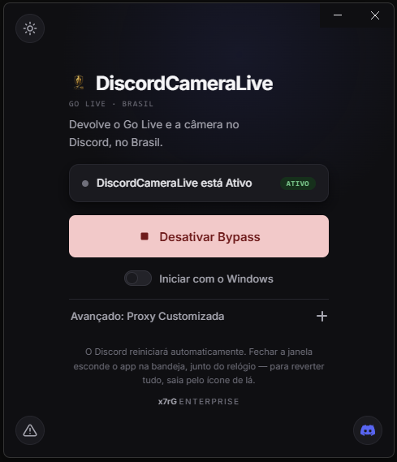

# DiscordCameraLive — Bypass do Go Live no Discord (Brasil)

**Devolve o Go Live e a câmera para usuários brasileiros** no Discord para computador. Você não precisa entender de tecnologia para usar: o jeito mais fácil é o aplicativo de um clique logo abaixo.

Por dentro, só o WebSocket de gateway do Discord passa por uma proxy fora do Brasil — todo o resto sai direto, na sua velocidade normal. Os detalhes técnicos estão em [Como funciona](docs/como-funciona.md).

> **English summary at the end of this page.**

## Instalação rápida

  

1. Vá na **[última release](https://github.com/xx7rG/DiscordCameraLive/releases/latest)** aqui no GitHub.
2. Baixe o arquivo da sua plataforma:
   - **Windows:** `DiscordCameraLive.exe` (portátil, roda direto sem instalar)
   - **macOS (Apple Silicon):** `DiscordCameraLive.dmg` ou `DiscordCameraLive.zip`
   - **Linux:** `DiscordCameraLive-*.AppImage` (`chmod +x` e execute)
3. Abra o arquivo. O programa **não é assinado** — o sistema avisa na primeira vez (Windows: **Mais informações → Executar assim mesmo**; macOS: veja o passo a passo completo).
4. Clique em **"Ativar Bypass"**. O Discord reinicia sozinho com o Go Live desbloqueado.

É a sua primeira vez instalando algo assim, ou vai ajudar alguém que não manja de computador? Siga o **[guia passo a passo para leigos](docs/comecando.md)** — mesmos passos de cima, mas bem devagar, com o que fazer em cada aviso do Windows/Mac.

Prefere um comando no terminal, já usa Equicord/Vencord, ou quer instalar tudo à mão? O **[guia de instalação completo](docs/instalacao.md)** cobre todos os caminhos — GUI, instalador automático, modo standalone, manual passo a passo, e o Vesktop.

## Avisos importantes

- **Só funciona no Discord para computador** (com Equicord/Vencord injetado, ou standalone direto). Não funciona no navegador nem no celular.
- **Proxies gratuitas são fracas para anonimato** — para privacidade de verdade, use Tor.
- Usar clientes modificados e proxies para contornar a restrição pode violar os Termos de Serviço do Discord. Use por sua conta e risco.
- **O programa nunca te deixa sem conseguir abrir o Discord** — se a proxy falhar, a conexão cai para direta.

Detalhes completos (o que o programa toca no seu sistema, riscos, licença) em [SECURITY.md](SECURITY.md) e [docs/como-funciona.md](docs/como-funciona.md).

## Documentação

| Guia | Conteúdo |
|---|---|
| [docs/comecando.md](docs/comecando.md) | Passo a passo bem devagar, para quem nunca instalou nada assim — sem termos técnicos |
| [docs/instalacao.md](docs/instalacao.md) | Todos os jeitos de instalar: GUI (Windows/macOS/Linux), um comando só, instalador automático, modo standalone, manual passo a passo, Vesktop, notas por distro Linux |
| [docs/como-funciona.md](docs/como-funciona.md) | Por que o plugin existe, por que o Go Live volta a funcionar, as duas travas que ele desarma, como as proxies são escolhidas |
| [docs/solucao-de-problemas.md](docs/solucao-de-problemas.md) | Problemas comuns e como resolver, e o que o arquivo de registro conta |
| [docs/desenvolvimento.md](docs/desenvolvimento.md) | Estrutura do projeto, como rodar localmente, testes e CI |
| [SECURITY.md](SECURITY.md) | O que o programa modifica no seu sistema, licença/procedência, como reportar um problema de segurança |

## Licença

GPL-3.0-or-later, mesma licença do Vencord/Equicord. Veja [LICENSE](LICENSE).

## Créditos

**[bezumiya](https://github.com/bezumiya)** criou o **GoLiveBypass**, o projeto original do qual este fork nasceu — [bezumiya/GoLiveBypass](https://github.com/bezumiya/GoLiveBypass), [@obezumiya](https://twitter.com/obezumiya).

**Obrigado ao [mazxxy](https://github.com/mazxxy)** pela ideia que virou a espinha dorsal do projeto: foi o primeiro a notar que o `session.setProxy` vale para a sessão inteira e a propor, na [PR #3](https://github.com/bezumiya/GoLiveBypass/pull/3), o desenho que o bypass usa até hoje — um SOCKS5 local com um PAC embutido mandando só o gateway pela proxy.

**Obrigado ao [Vithor](https://github.com/Vith0r)** pelo primeiro instalador do GoLiveBypass, escrito por conta própria — foi ele quem mostrou que dava para automatizar tudo num script só.

**Obrigado ao [cleo-dev](https://github.com/cleo-dev)** por construir a interface gráfica do zero, levando o projeto a quem nunca abriria um terminal.

**Obrigado ao [Eduardo Vasconcelos](https://github.com/EduardoVasconceloss)** pelo fork [StreamFix](https://github.com/EduardoVasconceloss/StreamFix): revisões adversariais que encontraram erros reais (veredito da sessão lido cedo demais, teto de tentativas furado por reconexões em rajada, regra de proxy do sistema atropelada) e portaram o roteador SOCKS local para dentro do plugin.

**Obrigado ao [gabrigode](https://github.com/gabrigode)** pelo suporte a Flatpak no instalador de Linux — achou o deploy do Flatpak (sistema e usuário), liberou a pasta do bypass para o sandbox com `flatpak override`, e documentou a pegadinha do `flatpak update`.

**Obrigado à [StellaThimoty](https://github.com/StellaThimoty) e ao [pdl-clay](https://github.com/pdl-clay)** pelo caminho do Vesktop — ela descobriu e testou que dava para apontar o "Vencord Location" para um build manual, ele transformou o relato dela no passo a passo completo.

**Obrigado ao [Victor Mello](https://github.com/victorsvart)** pelo fork [GUI-MacOS](https://github.com/victorsvart/GoLiveBypass-GUI-MacOS): a interface gráfica existia só no Windows, ele fez a portabilidade para o macOS.

### Este fork: DiscordCameraLive

Mantido por **[x7rG](https://github.com/xx7rG)**. A partir do GoLiveBypass original, este fork renomeou o projeto, colocou a GUI Electron para rodar com isolamento de contexto e uma Content-Security-Policy (antes rodava com `nodeIntegration` ligado e sem isolamento nenhum), tornou a troca do `app.asar` transacional — com rollback automático se alguma etapa falhar no meio —, adicionou CI de validação em todo push/PR, e reorganizou esta documentação em guias menores para ficar mais fácil de achar as coisas.

# English

**DiscordCameraLive** is an **Equicord/Vencord** plugin, made by a Brazilian developer, that **restores Go Live and camera for Brazilian Discord users**. On every launch it brings up a small local SOCKS router (loopback only) and points only Discord's gateway WebSocket hosts at it; the router carries that traffic through an exit outside Brazil — your own proxy, a local Tor, or a free proxy picked and tested for you — while **everything else stays direct at full speed**. Discord's region gate, evaluated once at voice-channel join from the gateway origin IP and never re-evaluated mid-call, then unlocks Go Live and camera. As a bonus, the login itself can optionally be routed too, hiding your real IP during authentication.

It was written after Brazil's data protection authority (ANPD) [ordered Discord to suspend live streaming (Go Live) in Brazil](https://www.gov.br/anpd/pt-br/assuntos/noticias/em-medida-preventiva-anpd-determina-que-discord-suspenda-transmissoes-ao-vivo-no-brasil) in August 2026, shortly after the country blocked X (Twitter). Because the gateway stays routed for the whole session, reconnects are born behind the same exit and the unlock survives network hiccups; if the exit dies, the router fails over to a tested reserve or fails open to a direct connection — never leaving you unable to open Discord. If the server still reports the session blocked, the plugin reloads the client behind the exit, at most twice. Bypassing the restriction may violate Discord's ToS.

- Desktop Discord with Equicord or Vencord injected, Flatpak included. **Vesktop is supported manually** — see [Instalação no Vesktop](docs/instalacao.md#instalação-no-vesktop). Equibop and Snap are not: Equibop bundles the mod instead of loading it from a checkout, and Snap lives in a read-only squashfs. Not available on the browser extension.
- Dependencies: Git, Node.js 22+, pnpm 11 (via `corepack enable`), and a desktop Discord client. Tor is optional, not required: by default the plugin picks and validates a free proxy on its own.
- **Your calls stay on the region you pick.** Creating the session abroad makes Discord rank foreign voice servers, so the plugin overrides the three `RTCRegionStore` getters that feed `preferred_region` / `preferred_regions` in the gateway `VOICE_STATE_UPDATE`. The override is evaluated at read time, so Discord's latency test cannot undo it, and it writes nothing into Discord's persisted state, so the region is not left pinned after you remove the plugin. Restored on `stop()`.
- Proxy order: your manual proxy, then the exits saved from last boots (revalidated), then a local Tor (`127.0.0.1:9150` for Tor Browser, `9050` for the daemon), then a validated free proxy.
- Free proxies are weak for anonymity — prefer Tor.
- Free proxies are ranked by the `alive` / `uptime` / `timeout` metadata the list already returns, port 4145 is dropped (measured 14/14 TLS interception), candidates race in batches of 12 and the first good one wins, and the test is a real TLS handshake through the tunnel against Cloudflare's trace (proving tunnel, valid certificate, real exit country and exit IP in one connection) followed by a reachability check against `gateway.discord.gg`. Up to 5 verified exits are kept for 24h in a pool. Measured: random pick with a handshake-only test works 12% of the time, ranked with a real TLS test works 60%.
- It cannot leave you unable to open Discord: the fallback decision lives inside the local router, not in the PAC (no `PROXY;DIRECT` for Chromium to silently prefer), a per-connection 12s stall budget fails open to direct, reserve exits take over mid-session, and a system proxy policy that varies per host (corporate PAC) makes the plugin refuse to enable rather than trample it.
- Install: copy the `discordCameraLive` folder into `src/userplugins/` of your Equicord or Vencord clone, then `pnpm install && pnpm build && pnpm inject`, fully restart Discord, and enable **DiscordCameraLive** in plugin settings. On **Vesktop**, skip `pnpm inject` and point Vesktop's *Vencord Location* at your build's `dist` folder instead (see [Instalação no Vesktop](docs/instalacao.md#instalação-no-vesktop)).
- Full install guide (GUI, one-liner, manual, Linux distro notes): [docs/instalacao.md](docs/instalacao.md).
- License: GPL-3.0-or-later.

## Credits

Original project by **[bezumiya](https://github.com/bezumiya)** — [bezumiya/GoLiveBypass](https://github.com/bezumiya/GoLiveBypass). Thanks to **[mazxxy](https://github.com/mazxxy)** for the idea this project is built on: a local SOCKS5 with an embedded PAC routing only the gateway through the proxy ([PR #3](https://github.com/bezumiya/GoLiveBypass/pull/3)). Thanks to **[Vithor](https://github.com/Vith0r)** for the first installer, which the current one grew out of. Thanks to **[cleo-dev](https://github.com/cleo-dev)** for building the original GUI app from scratch. Thanks to **[Eduardo Vasconcelos](https://github.com/EduardoVasconceloss)** for the [StreamFix](https://github.com/EduardoVasconceloss/StreamFix) fork: adversarial reviews that found real bugs, and for porting the local SOCKS router into the plugin. Thanks to **[gabrigode](https://github.com/gabrigode)** for Flatpak support in the Linux installer. Thanks to **[StellaThimoty](https://github.com/StellaThimoty)** and **[pdl-clay](https://github.com/pdl-clay)** for the Vesktop install path. Thanks to **[Victor Mello](https://github.com/victorsvart)** for the [GUI-MacOS](https://github.com/victorsvart/GoLiveBypass-GUI-MacOS) fork, porting the GUI to macOS.

**This fork, DiscordCameraLive, is maintained by [x7rG](https://github.com/xx7rG).** Renamed the project, hardened the Electron GUI (context isolation + CSP, previously ran with `nodeIntegration` on and no isolation), made the `app.asar` swap transactional with automatic rollback on failure, added push/PR CI, and split this documentation into smaller guides.
